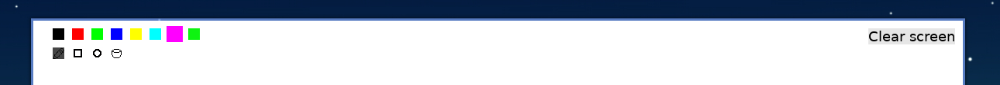

# PygPaint 
Drawing application made with pygame

https://github.com/simplycode07/Paint-app-with-pygame/assets/72332741/3d718225-b3c0-4a7e-b3bd-1da7c5e55c1a

## Worst painting app ever!! (probably but atleast it works)
It's a really basic and one of the worst painting app ever created

## Features
To be honest nothing much but
- You can Create really bad images with it
- You can Save "masterpieces" that you have created
- Added tool to draw rectangles and circles
- Fill Area
- but it comes with a color palette with 7 colors and a random color which is generated when program starts

## How To Use
- Run the program by ```python main.py```
- There are different buttons for different colors in the first row
- In the second row there are three tools, for drawing with pen, rectangle tool and circle tool

- To use any drawing tool: first select preferred color, drag from diametrically opposite ends

- Press ctrl+s to save the drawn image
- Click on =/- to change size of pen

## Example images


